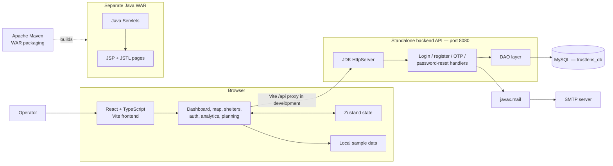
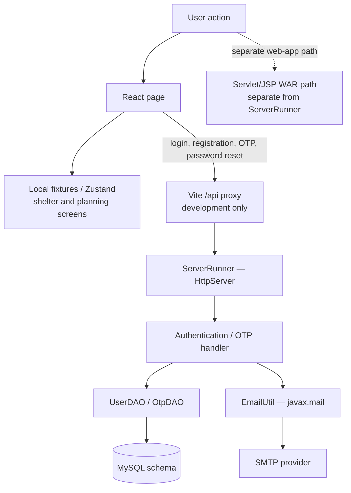
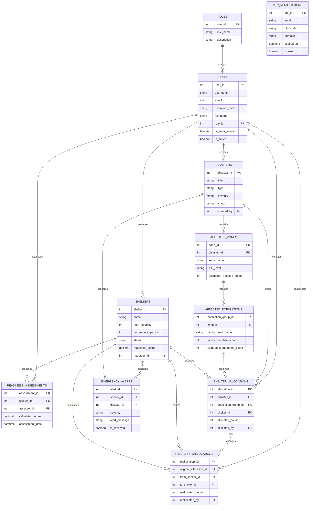

# TRUSTLENS

TRUSTLENS is a shelter-readiness and emergency-response planning application. It combines a React dashboard and map-based planning demonstrations with a Java authentication backend, email OTP flows, and a MySQL data model for disaster and shelter operations.

> **Project status:** Authentication endpoints are implemented in the Java backend. Shelter maps, readiness visualizations, allocation, scenarios, inspection results, and analytics in the frontend still use local demonstration data. The repository includes both a Java Servlet/JSP WAR application and a standalone `HttpServer` API runner; these are distinct runtime paths and are not wired together as one servlet container entry point.

## Contents

- [Features](#features)
- [Screenshots](#screenshots)
- [Technology stack](#technology-stack)
- [Architecture](#architecture)
- [Data flow](#data-flow)
- [Database ER diagram](#database-er-diagram)
- [Project structure](#project-structure)
- [Getting started](#getting-started)
- [Backend configuration and build](#backend-configuration-and-build)
- [Limitations and production considerations](#limitations-and-production-considerations)

## Features

- Operations dashboard with shelter KPIs and readiness summaries.
- Shelter directory, detail panels, readiness factors, and map visualization.
- Map layers for sample shelters, affected zones, flood areas, roads, and blocked roads.
- Local inspection image preview with illustrative, non-AI output.
- Local scenario and allocation demonstrations.
- Analytics charts backed by bundled sample data.
- Login, registration, forgot-password, and password-reset user flows.
- Java API handlers for login, registration, sending/verifying OTPs, and resetting passwords.
- MySQL schema for users and roles, disasters, affected populations, shelters, readiness, allocations, reallocations, and emergency alerts.

## Screenshots


## Technology stack

### Frontend

- React 19 and TypeScript
- Vite and React Router
- Zustand for in-memory frontend state
- React Leaflet and Leaflet for maps
- Recharts for visualizations
- Tailwind CSS v4
- Lucide React icons and Framer Motion

### Backend

- Java 17
- Apache Maven with `war` packaging
- Java Servlets (`javax.servlet`) and JSP (`javax.servlet.jsp`), with JSTL
- JDK embedded HTTP server (`com.sun.net.httpserver.HttpServer`) for the standalone API runner
- MySQL and MySQL Connector/J
- `javax.mail` and Java Activation for SMTP email/OTP delivery
- Gson for JSON responses and jBCrypt for password hashing

## Architecture

The repository currently has two Java web execution paths:

1. **Standalone API runner:** `ServerRunner` starts the JDK embedded HTTP server on port `8080` and registers handlers for the `/api/*` authentication routes. The Vite development server proxies `/api` requests to this server.
2. **Servlet/JSP WAR:** `backend/pom.xml` packages a WAR containing servlet classes, JSP pages, and `web.xml`, intended for a compatible servlet container such as Tomcat 9. The standalone `HttpServer` does not itself execute the Servlet/JSP application.



### Backend request lifecycle

- The Vite development server listens on port `5173` and proxies `/api` to `http://localhost:8080`.
- `ServerRunner` registers API handlers for `/api/login`, `/api/register`, `/api/send-otp`, `/api/verify-otp`, `/api/forgot-password`, and `/api/reset-password`.
- Handlers use DAO implementations for user and OTP persistence through the MySQL connection helper.
- OTP flows use `EmailUtil` and `javax.mail` to send messages through the configured SMTP service.
- Separately, Maven builds the Servlet/JSP web application as `backend/target/trustlens.war` for deployment to a compatible servlet container.

The standalone HTTP API and the WAR are both present, but Maven WAR packaging alone does not start `ServerRunner`; the deployment/runtime wiring between the two paths needs to be made explicit for production.

## Data flow



### Current frontend data

Shelter, affected-zone, road, flood-zone, and scenario data are bundled TypeScript fixtures in `frontend/src/data/`. Most operational dashboard views use those local fixtures rather than loading the corresponding MySQL records. Authentication screens make API requests; ensure the API is reachable at the configured origin outside the Vite development proxy.

## Database ER diagram

The diagram reflects the entities and foreign-key relationships in [`backend/database/schema.sql`](backend/database/schema.sql). Fields shown are representative; consult the schema for the complete column definitions and constraints. OTP records are associated by email in the current schema and have no declared foreign key.



## Project structure

```text
TRUSTLENS/
├── backend/
│   ├── database/schema.sql       # MySQL database and tables
│   ├── pom.xml                   # Java 17 Maven WAR project
│   └── src/main/
│       ├── java/com/trustlens/   # HTTP runner, servlets, DAOs, models, utilities
│       └── webapp/               # JSP pages and WEB-INF/web.xml
├── frontend/
│   ├── public/                   # Static assets and dashboard screenshot
│   └── src/
│       ├── components/           # Layout, maps, shelters, analytics, inspection
│       ├── data/                 # Local sample data
│       ├── pages/                # Route-level screens
│       ├── store/                # Zustand state
│       └── utils/                # Readiness calculations
├── start-backend.bat
└── README.md
```

## Getting started

### Requirements

- Node.js and npm versions compatible with `frontend/package.json`
- Java Development Kit (JDK) 17
- Apache Maven
- MySQL

### Configure MySQL

Create/configure the database using `backend/database/schema.sql`. Set `DB_URL`, `DB_USER`, and `DB_PASSWORD` in the backend environment before starting the API. The backend also reads `SMTP_HOST`, `SMTP_PORT`, `SMTP_USER`, and `SMTP_PASS` for OTP email. Use private local environment configuration; never commit real database or mail credentials.

### Run the frontend

From the repository root in PowerShell:

```powershell
Set-Location frontend
npm ci
npm run dev
```

Vite serves the frontend on port `5173` and proxies `/api` to the backend at `http://localhost:8080`.

### Run the backend

The standalone runner starts on port `8080`. The repository includes `start-backend.bat`, but it contains machine-specific dependency paths and may need adjustment on another computer. Prefer a portable, project-local Maven/runtime configuration before using it in a shared or production environment.

### Frontend checks

Run from `frontend/`:

```powershell
npm run lint
npm run build
```

The production frontend is generated in `frontend/dist/`.

## Backend configuration and build

The backend Maven project is in `backend/`. Build its WAR from the repository root with:

```powershell
mvn -f backend/pom.xml clean package
```

The configured artifact name is `backend/target/trustlens.war`. The POM targets Java 17 and declares Servlet/JSP APIs as provided dependencies. Deploy the WAR to a compatible servlet container (the dependencies target the `javax.servlet` generation, such as Tomcat 9). This WAR deployment is distinct from launching the standalone `ServerRunner` API.

`backend/.env.example` documents the database and SMTP variables. Supply actual values through a private `.env` or the hosting environment; do not store secrets in source control. Confirm the runtime's `.env` loading and mail settings before relying on OTP delivery.

## Limitations and production considerations

- Shelter, hazard, road, zone, readiness, scenario, and allocation screens use sample data and are not yet backed by the MySQL operational tables.
- The embedded API currently implements authentication and OTP/password-reset flows, not the full shelter/disaster management API.
- The Servlet/JSP WAR and standalone `HttpServer` API are separate runtime paths. Define and test their deployment relationship before production.
- Scenario and allocation results are demonstrations, not operational response recommendations.
- Inspection output is illustrative and must not be used for structural safety assessment or certification.
- Configure production CORS, authentication/session handling, HTTPS, database permissions, input validation, logging, monitoring, backups, and secret rotation before deployment.
- Email delivery requires valid SMTP configuration. Do not commit real credentials.
- OpenStreetMap tiles require an internet connection; review the provider's usage policy before production deployment.
- Configure static hosting to serve `frontend/index.html` for client-side routes such as `/shelters` and `/analytics`. Configure the production API origin and CORS/route behavior explicitly; Vite's proxy applies only during development.
